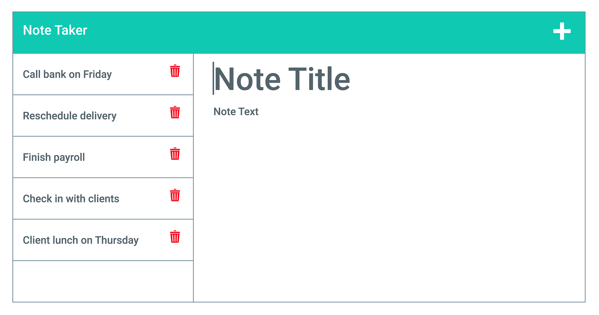

# Note-Taker 📝 🤪


## About this Project

This assessement was to modifify a starter code and create a app called Note Taker that can be used to write, save and delete notes.

Also, first app deployed on Heroku 😬

## Deploy Link

## Mock up



## Content

- [User Story](#user-story)
- [Acceptance Criteria](#acceptance-criteria)
- [Technologies](#technologies)
- [Sources](#sources)
- [Project Creator](#project-creator)

## User Story

```md
AS A small business owner
I WANT to be able to write and save notes
SO THAT I can organize my thoughts and keep track of tasks I need to complete
```

## Acceptance Criteria

```md
GIVEN a note-taking application
WHEN I open the Note Taker
THEN I am presented with a landing page with a link to a notes page
WHEN I click on the link to the notes page
THEN I am presented with a page with existing notes listed in the left-hand column, plus empty fields to enter a new note title and the note’s text in the right-hand column
WHEN I enter a new note title and the note’s text
THEN a Save icon appears in the navigation at the top of the page
WHEN I click on the Save icon
THEN the new note I have entered is saved and appears in the left-hand column with the other existing notes
WHEN I click on an existing note in the list in the left-hand column
THEN that note appears in the right-hand column
WHEN I click on the Write icon in the navigation at the top of the page
THEN I am presented with empty fields to enter a new note title and the note’s text in the right-hand column
```

## Technologies

- Node/Express js - backend;
- JavaScript;
- File System;
- Path npm package;

## Sources

[Express](https://expressjs.com/en/starter/hello-world.html)

## Project Creator

[EllaFerreira](https://github.com/EllaFerreira)

© 2021 Team Profile Generator. All rights reserved
